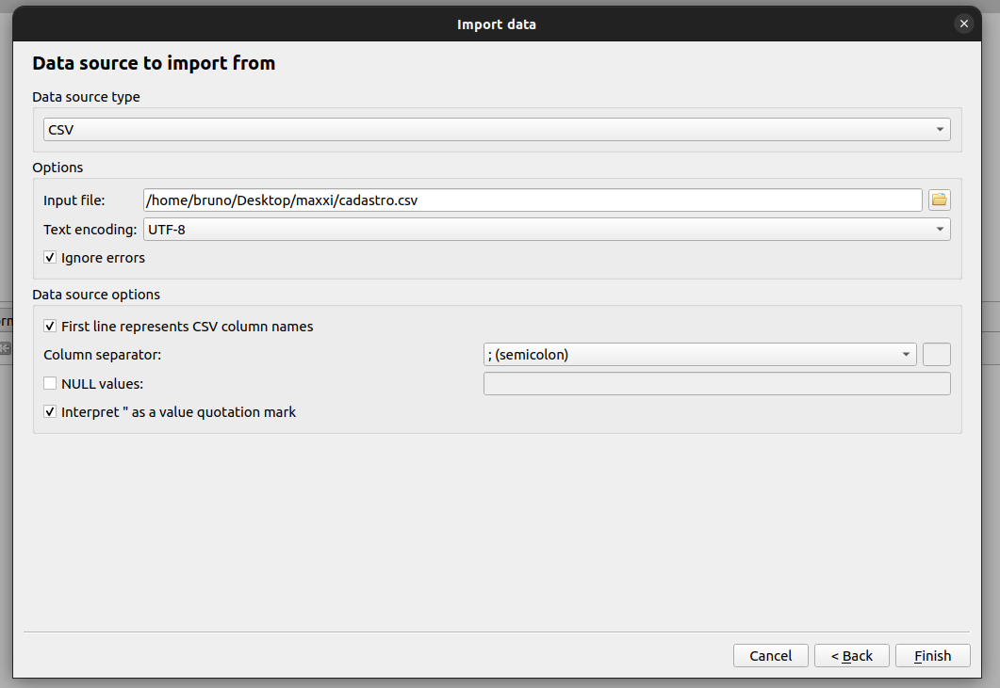
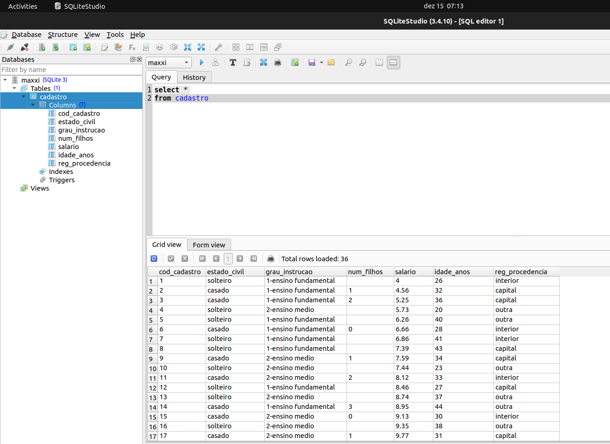
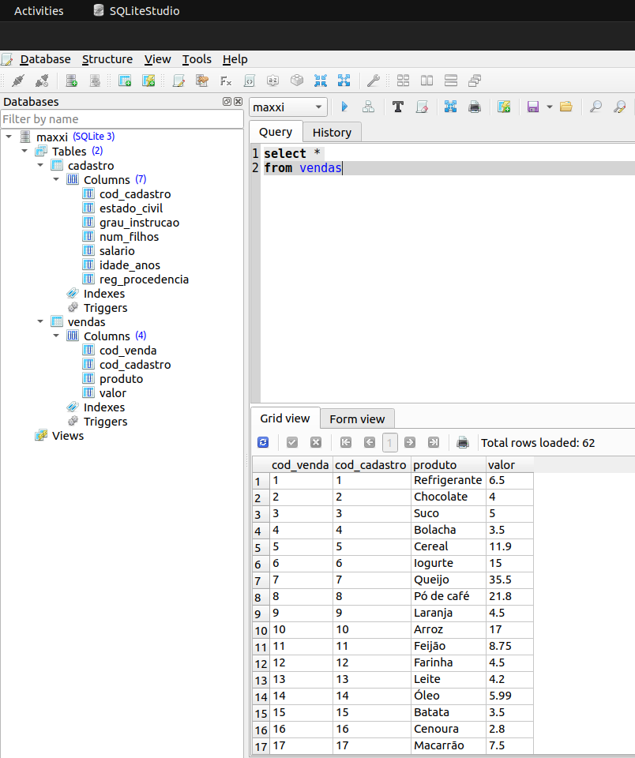
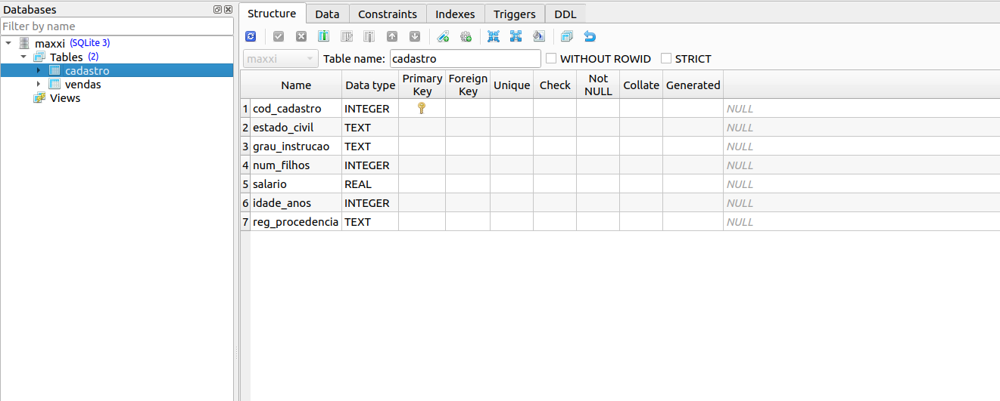
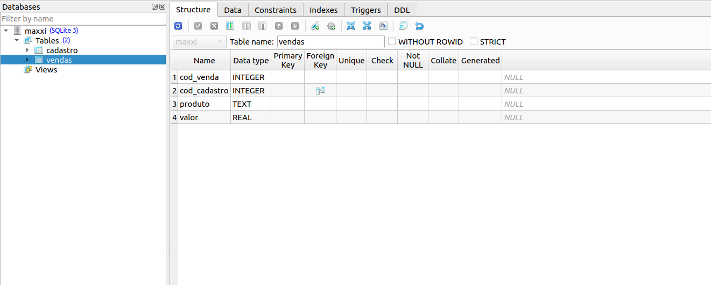
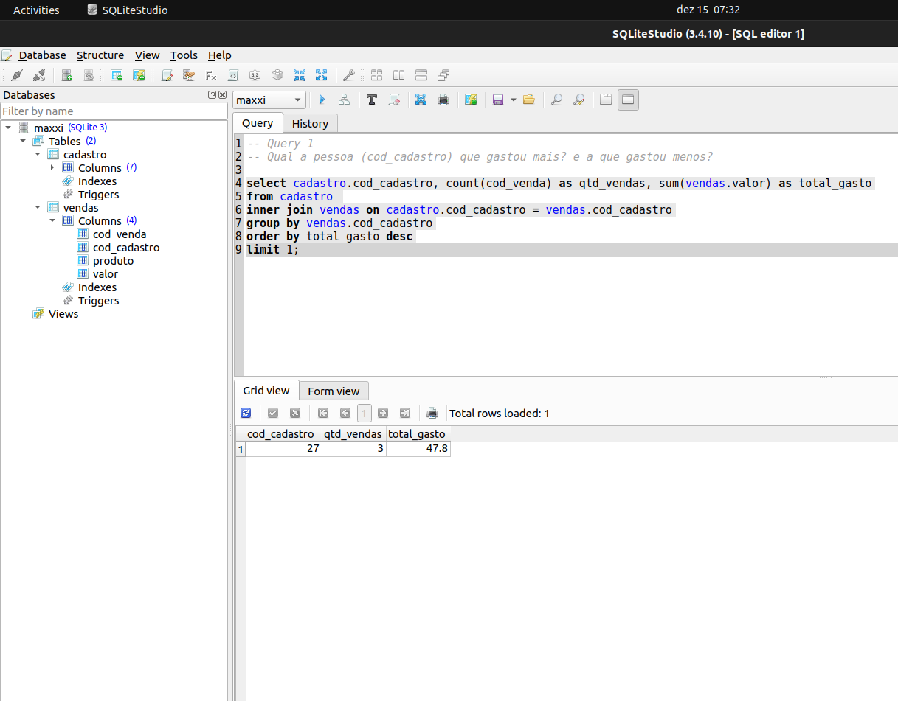
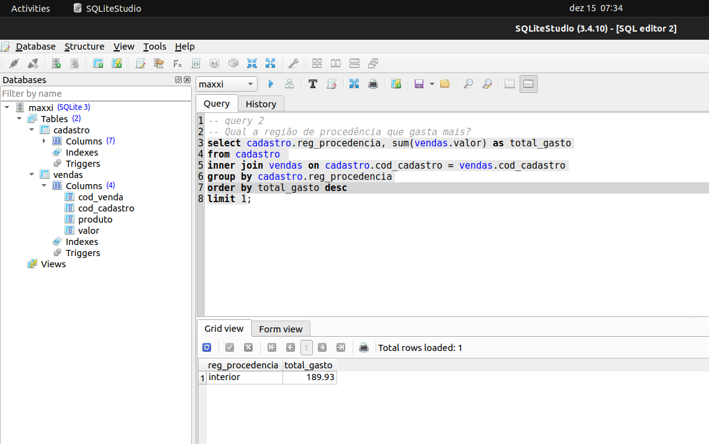
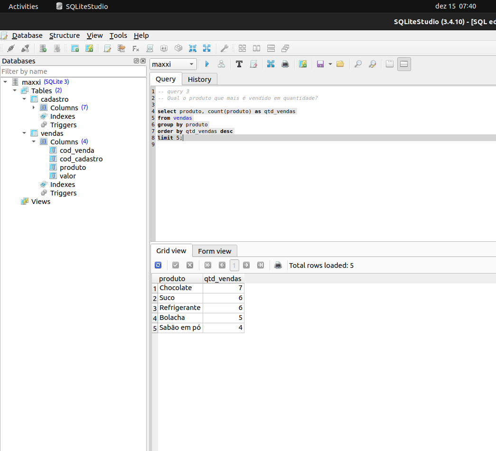
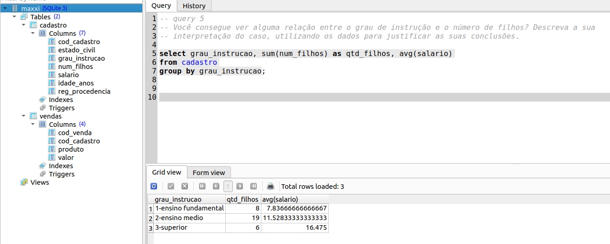

## Desafio PT1 

Instruções e orientação de como o desafio foi realizado

1. Após fazer o download dos arquivos .csv criei o schema do banco de dados usando SQLITE pelo terminal ubuntu 
```bash
sqlite maxxi.db
```

2. Em seguida, criei uma tabela para que eu conseguisse visualizar o arquivo .db no diretorio em que ele foi alocado, pois nao estava conseguindo 
visualizar enquanto ele ainda estivesse vazio
```sql
CREATA TABLE cadastro (
    cod_cadastro INTEGER PRIMARY KEY AUTOINCREMENT
)
```

3. Quando consegui visualizar o arquivo .bd eu abri o SQlite studio e fiz a importação dos arquivos .csv para atualizar as tabelas com as colunas presentes
no arquivo .csv



O mesmo fiz o csv vendas

4. Verifiquei se de fato os dados tinha sido importados e estavam se comportando de forma normal, para ambas as tabelas



5. Iniciei a configuração das tabelas, adicionando a chave primária, a chave estrangeira e o tipo de dado de cada coluna



6. Após finalizar as configurações, comecei a realizar as querys 

### Query 1 

A primeira query foi realizada com as seguintes instruções
```sql
select cadastro.cod_cadastro, count(cod_venda) as qtd_vendas, sum(vendas.valor) as total_gasto
from cadastro 
inner join vendas on cadastro.cod_cadastro = vendas.cod_cadastro
group by vendas.cod_cadastro
order by total_gasto desc
limit 1;
```

Fiz um join entre as tabelas cadastro e vendas pela chave primária configurada "cod_cadastro" e realizei algumas agregações no select, como:
- ``count(cod_venda) as qtd_vendas`` para que conte a quantidade de vendas
- ``sum(vendas.valor) as total_gasto`` para que fizesse a soma de todos os valores

Para que essas duas agregações estivesse agrupadas por comprador (cod_cadastro) utilizei a instrução 
- ``group by vendas.cod_cadastro``

utilizei também como prefixo do .cod_cadastro a tabela vendas, pois, a principio antes de realizar a query desta forma, deu erro de ambiguidade entre colunas
por não estar referenciando em qual tabela seria.

Para finalizar a query, ordenei pela quantidade maior e menor de total_gasto (alias da nova coluna que resulta na soma dos valores)
e limitei o resultado em 1.

Eu poderia ter realizado a query apenas com a soma dos valores e agrupado pelo comprador, mas também preferi visualizar a quantidade de vendas, para justificar o por que determinado comprador gastou mais e o outro menos, não se resumindo apenas a preço do produto e sim pela qunatidade de compras realizadas. 




### Query 2

Segunda query

```sql
select cadastro.reg_procedencia, sum(vendas.valor) as total_gasto
from cadastro 
inner join vendas on cadastro.cod_cadastro = vendas.cod_cadastro
group by cadastro.reg_procedencia
order by total_gasto asc
limit 1;
```

Utilizando a mesma lógica que a query anterior, apenas ajustei para agrupar por região de procedencia para visualizar qual região gastou mais, resultando em: 
O interior realizou mais gastos que as demais regiões, com um somatório de R$189.93. Isso pode ou não significar que foi a região que mais realizou compras, porém não fiz essa análise. 



### Query 3

Terceira query 

```sql
select produto, count(produto) as qtd_vendas
from vendas
group by produto
order by qtd_vendas desc
limit 5;
```

A terceira query onde é apenas para visualizar o produto mais vendido em quantidade, dispensou a necessidade de joins, como nas outras 2 queyrs e apenas realizei uma contagem da quantidade de vendas e agrupando por produto, ordenando também de forma decrescente para ter acesso aos maiores valores. 

Poderia informar apenas o maior produto que foi vendido, mas gostei de visualizar os 5 mais vendidos para identificar a diferença ou até mesmo a "categoria". 



### Query 4

A quarta query, que pede para que identifiquemos o grupo (top5) de pessoas que mais realizam compras e mais gastam em relação a valor, existe uma característica em comum entre a maioria dos que visualizei que é a idade e o salário. 

Pessoas com salários maiores e idades maiores que a média do todo, estão propensas a realizarem mais compras e a gastem mais. 

```sql
-- query para identificar a media de idade e media salarial
select avg(idade_anos) as media_idade, avg(salario) as media_salarial
from cadastro;

-- query para visulizar e identificar características em comum entre os compradores
select count(cod_venda) as qtd_compras_realizadas, idade_anos, salario, sum(valor) as total_gasto
from cadastro
inner join vendas on cadastro.cod_cadastro = vendas.cod_cadastro
group by vendas.cod_cadastro
order by total_gasto desc
limit 5;
```

Identifiquei:
- A maioria entre os maiores compradores são solteiros e possuem salários maiores
- Um dos maiores compradores, só teve apenas 1 compra que foi um Queijo no valor de R$35.5
- Não é possivel criar parametros com numero de filhos, regiao de procedencia e grau de instrução, pois a amostra não segue um padrão rigoroso


### Query 5 

Na quinta query, devemos identificar se há alguma relação entre grau de instrução a quantidade de filhos 

```sql
select grau_instrucao, sum(num_filhos) as qtd_filhos, avg(salario)
from cadastro
group by grau_instrucao; 
```

Selecionei apenas da tabela cadastro o grau de instrução, fiz um somatório do numero de filhos e agrupei pelo grau de instrução para visualizar qual categoria de ensino, possuía maior quantidade de filhos, porém, numa análise tardia, também identifiquei que possuem mais pessoas com ensino medio completo, em comparação com os demais graus de instrução, o que pode também influenciar no resultado e na análise final.

Resultado: de certa forma sim, pessoas com grau de instrução menor possui uma maior quantidade de filhos e além disso, também possuem uma média de salario menor do que com pessoas com ensino superior. Mas, isso pode se dar ao fato também de cultura e classe social, pessoas em classes sociais mais baixas tendem a ter uma quantidade maior de filhos, devido a falta de instrução e orientação sobre métodos contraceptivos. 



### 6. Imagine que a empresa em questão queira desenvolver um programa de cashback de benefícios baseada no perfil dos clientes, sendo assim, o primeiro passo seria desenvolver este perfil. Proponha um critério para classificar os clientes em clientes diamante, ouro e prata . Justifique a sua resposta.

Com os dados que foram disponibilizados, podemos adotar como critério a quantidade de compras realizadas pelo cliente ou valor gasto. Devido que, os demais dados como: quantidade de filhos, região e grau de instrução, não são capazes de determinar se um cliente é elegível para determinados benefícios do supermercado.

1. Pode-se adotar critérios levando em consideração a **QUANTIDADE DE COMPRAS** realizadas pelo cliente, da seguinte maneira:
- Se o cliente realiza entre 1-3 compras por mês, num período mínimo de 3 meses, ele se encaixa na categoria bronze 
- Se o cliente realiza entre 3-5 compras por mês, num período mínimo de 4 meses, ele se encaixa na categoria prata 
- Se o cliente realiza mais de 5 compras por mês, dentre um período mínimo de 5 meses, ele se encaixa na categoria ouro

Além disso, dando benefícios e mostrando vantagens aos clientes que, quanto maior sua categoria, mais descontos ou condições de compras melhores ele vai ter. 

2. Podemos também determinar pelo **VALOR GASTO EM CADA COMPRA**:

Um cliente que compra mais de 5 vezes no supermercado, pode ir para apenas comprar uma água mineral que possui um preço baixo entre R$1.00 a R$ 2.00
Isso não é o suficiente para determinar o perfil de cada comprador, pois pode haver compradores que são donos de estabelecimentos comerciais ou apenas compradores que estão indo fazer as compras mensais da sua casa ou só alguém que passou pelo estabelecimento, longe da sua rotina.

Determinar um valor mínimo de compra, pode ser melhor para identificar o tipo do comprador e poder direcionar melhores benefícios para cada um.
